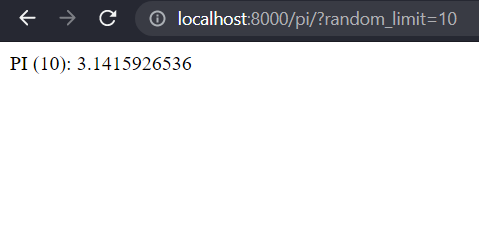
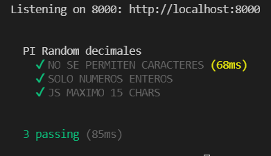

# YAPO_API


## PRE-REQUISITOS
- Git
- Docker
- Node JS
- WIndows 10
## INSTALACION
1. Crear carpeta local que contendrá la aplicacion (Ej: C:\ACM_TEST)
2. Dentro de ACM_TEST abrir consola de comandos y ejecutar : 
```sh
C:\ACM_TEST> git clone https://github.com/FIXDISC/yapo_api.git
```
3. Acceder a la carpeta del proyecto yapo_heroes e instalar dependencias :
```sh
cd C:\ACM_TEST\yapo_api\
```
```sh
C:\ACM_TEST\yapo_api> npm install
```
4. Generar el contenedor :
```sh
C:\ACM_TEST\yapo_api> docker build -t yapo_api .
```
5. Desplegar la imagen con el proyecto:
```sh
C:\ACM_TEST\yapo_api> docker run -it -p 8000:8000 yapo_heroes
```
6. Iniciar el proyecto y navegar en el browser a la url (http://localhost:8000/pi/?random_limit=10): 
```sh
C:\ACM_TEST\yapo_api> npm start
```  
http://localhost:8000/pi/?random_limit=10
   
7. La Api debe responder con mensaje:   
   PI (8): 3.14159265  (Donde 8 es el numero random de decimales)   
   F5 vuelve a generar decimales random.
  

## TESTING
Generar pruebas desde la linea de comandos :
```sh
C:\ACM_TEST\yapo_api> npm test
```

